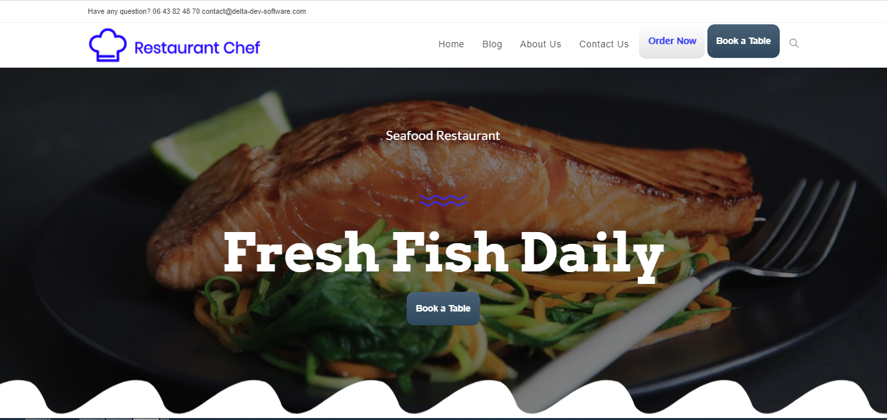

Restaurant Chef  is a  food ordering system for restaurants. It comes with a responsive design and user-friendly interface, which is compatible with desktops, laptops, mobile phones, and tablets.

Restaurant Chef is easy to set up and install. Menorah Restaurant comes with a lot of features like custom CMS, Order management, menu management, customer management, SMS Alerts, SEO optimization, Referral System etc..Using the admin panel, you can manage an order, create menu categories and items, and also set such parameters, as a currency, restaurant opening time, site logo etc. From the admin panel, you can add, update data.

## Table of contents
* [General info](#general-info)
* [Demo](#demo)
* [Screenshots](#screenshots)
* [Technologies](#technologies)
* [Setup](#setup)
* [Features](#features)
* [Status](#status)
* [Contact](#contact)
* [License](#license)

## General info

## Demo

## Screenshots

## Technologies
* Wordpress - version 5.6

## Setup

## Features

## Status
Project is: _finished_

## Contact
contact@delta-dev-software.com

## License
<a href="license.txt">MIT License</a>